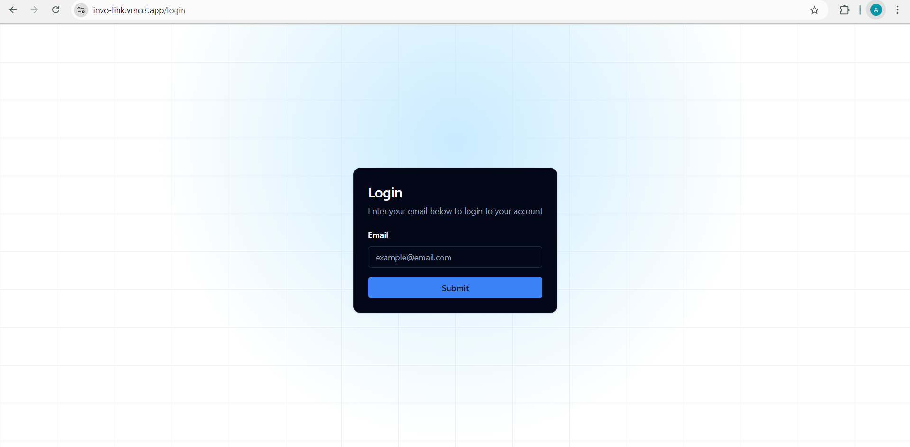
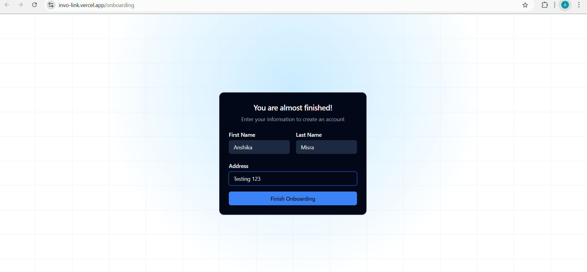
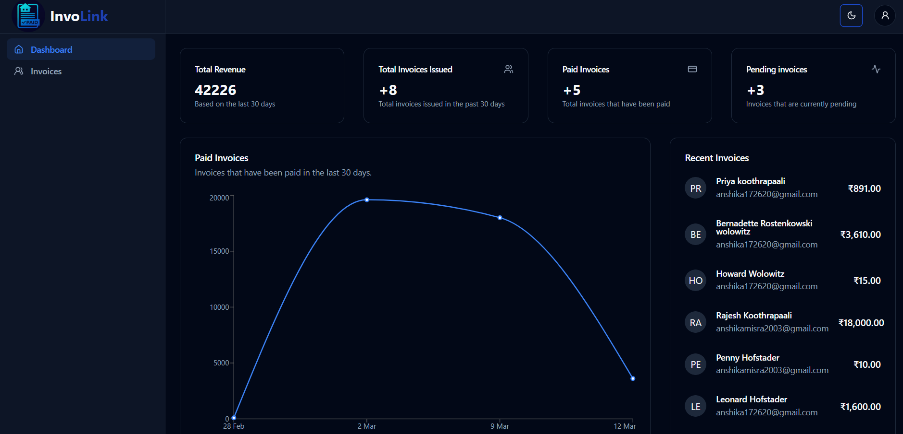
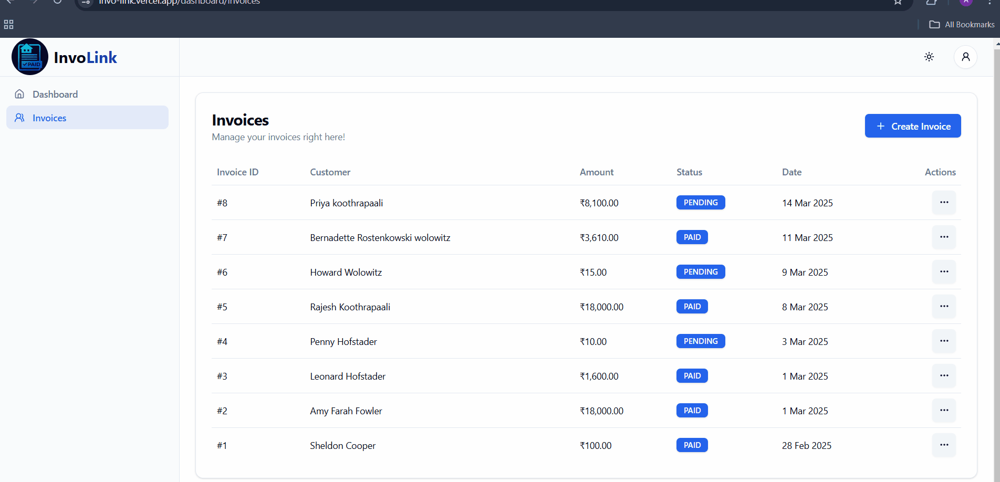
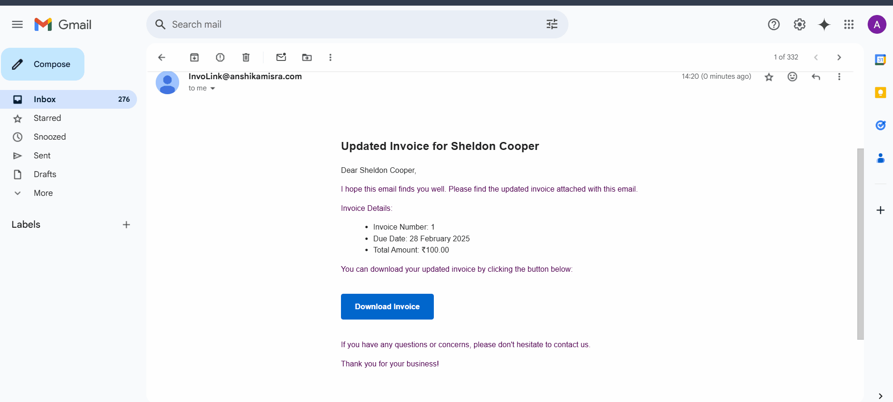

# Table of Contents
-[Project Description](#involink---invoice-management-platform)  
-[Features](#features)   
-[Screenshots](#screenshots)  
-[Tech Stack](#tech-stack)  
-[Usage](#usage)  
-[License](#license)  

# InvoLink - Invoice Management Platform
InvoLink is a powerful and secure invoice management platform designed to streamline the invoicing process for businesses and freelancers. With an intuitive dashboard, users can efficiently manage invoices, track payments, and generate professional PDF invoices from scratch. The platform provides real-time tracking of paid and unpaid invoices, automated email notifications to clients, and monthly payment insights through graphical representations. Built with a robust tech stack, InvoLink ensures that all financial records are stored securely, making invoice management seamless and hassle-free.  

# Features
🔑 Authentication & Security – Secure login using Auth.js with Magic Links, ensuring passwordless authentication and leads to an onboarding route to complete user registration.  
📝 Invoice Creation & Tracking – Easily create invoices, assign statuses (Paid/Unpaid), and track their progress.  
📊 Graphical Insights – Get a visual representation of monthly payments on the dashboard.  
📄 PDF Invoice Generation – Generate custom invoices in PDF format from scratch.  
📧 Automated Email Notifications – Send invoices, alerts, and updates to clients via SendGrid API.  
🚀 Real-time Invoice Updates – Get notified of invoice payments and status changes instantly.  
📂 Intuitive Dashboard – A clean and user-friendly dashboard for easy access to invoices and analytics.  
📱 Fully Responsive UI – Optimized for desktop, tablet, and mobile devices with Tailwind CSS, including light/dark/system themes.    
⚡ Robust & Scalable – Built with Next.js, TypeScript, Prisma ORM, and PostgreSQL for reliability and performance.  

# Screenshots
User registration -- Authentication using Auth.js magic links and sendgrid  

  
  

 
Dashboard  

Invoice Page

Workflow

Invoice creation

Pdf created from scratch using pdf.js

Email functionality:  
InvoLink offers passwordless authentication using Auth.js magic links and SendGrid  

Invoice email

Update email

Reminder email

Empty states for new users

  
  

 

# Tech stack
InvoLink is a full-stack application built with modern technologies:

### Frontend
- **Next.js** – Full-stack framework for React  
- **React.js** – Component-based UI library  
- **TypeScript** – Strongly-typed JavaScript  
- **Tailwind CSS** – Utility-first styling framework  

### Backend
- **Next.js API Routes** – Backend logic and endpoints  
- **PostgreSQL** – Relational database  
- **Prisma ORM** – Database management and queries  
- **Neon PostgreSQL** – Cloud-based PostgreSQL database  

### Other Integrations
- **SendGrid API** – Email services  
- **Zod** – Schema validation  
- **PDF.js** – PDF rendering and manipulation  

# Usage
The InvoLink platform is live and deployed. You can access it here:  
https://invo-link.vercel.app/

# License
This project is **not open-source**.  
Unauthorized copying, modification, or redistribution of this code is **not permitted**.
